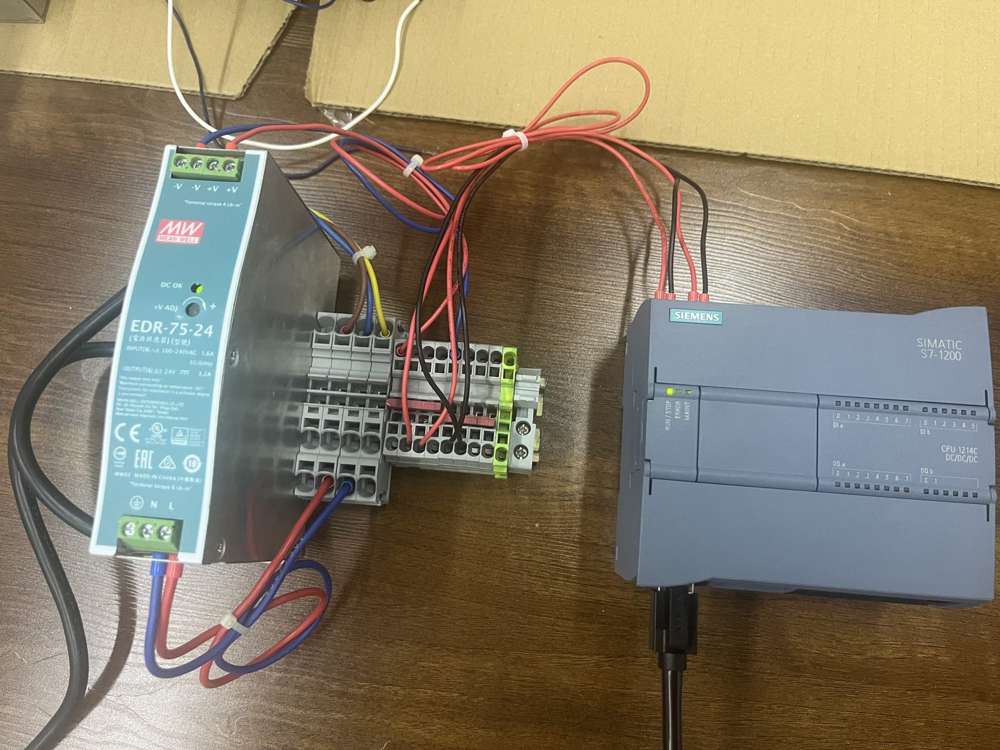
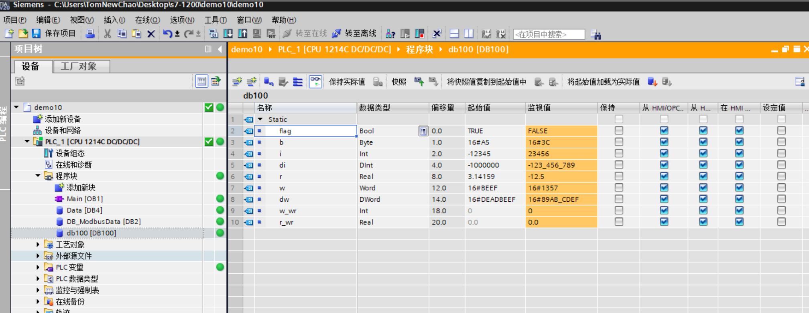
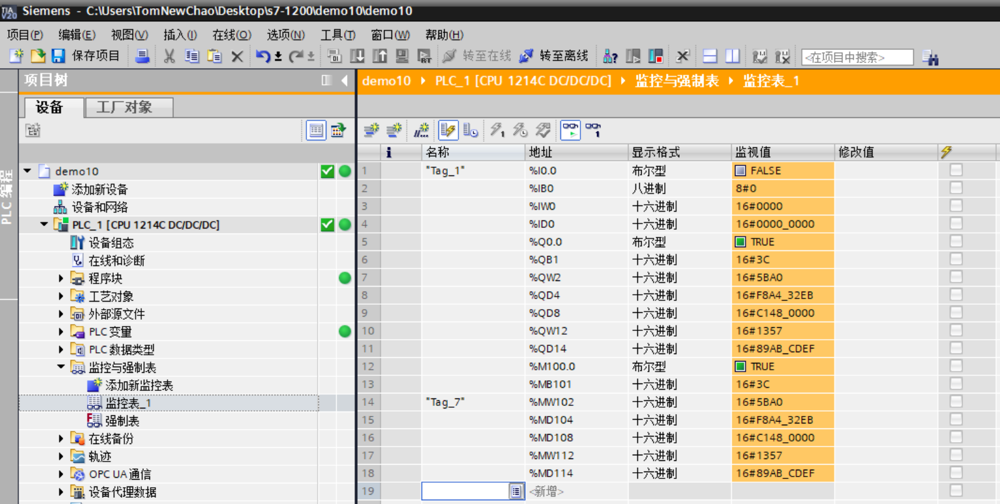
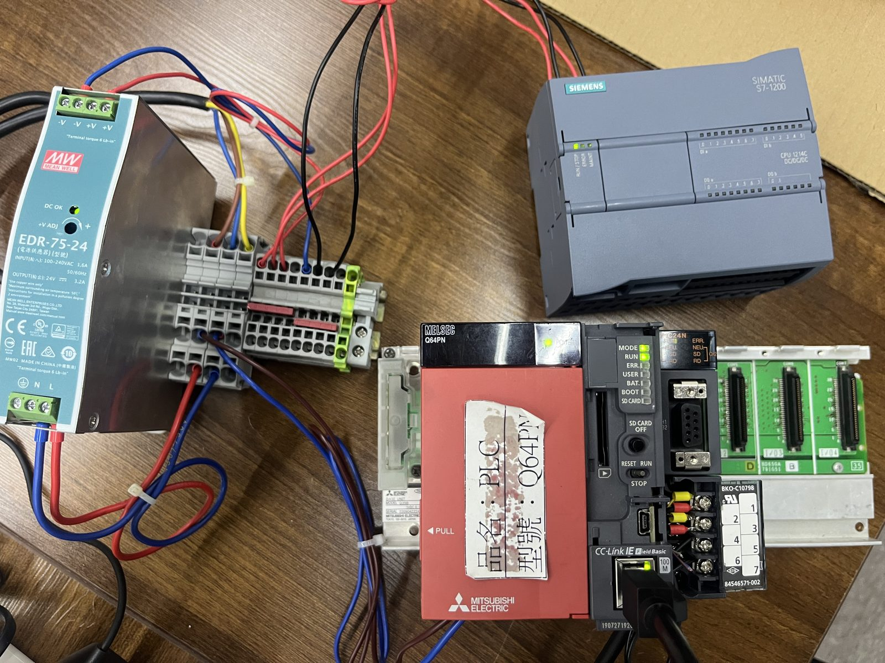
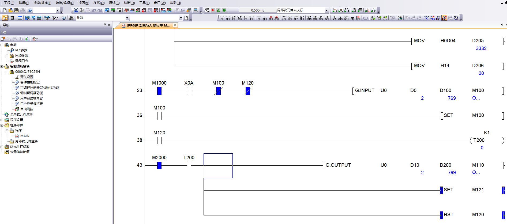

<!--
  Licensed to the Apache Software Foundation (ASF) under one
  or more contributor license agreements.  See the NOTICE file
  distributed with this work for additional information
  regarding copyright ownership.  The ASF licenses this file
  to you under the Apache License, Version 2.0 (the
  "License"); you may not use this file except in compliance
  with the License.  You may obtain a copy of the License at

      https://www.apache.org/licenses/LICENSE-2.0

  Unless required by applicable law or agreed to in writing,
  software distributed under the License is distributed on an
  "AS IS" BASIS, WITHOUT WARRANTIES OR CONDITIONS OF ANY
  KIND, either express or implied.  See the License for the
  specific language governing permissions and limitations
  under the License.
  -->
# Hardware verification

What the drivers have been proven to do against **physical devices**, how to
reproduce it, and what each result does not cover. The automated suite
(`docs/testing.md`) proves the drivers against scripted transports; this is the
part that faced real silicon.

## Verdict

| Protocol | Verified against | Result | Date |
|---|---|---|---|
| **S7** | Siemens S7-1214C DC/DC/DC, rack 0 / slot 1 | **PASS 50/50**, plus a persistent I/Q/M/DB matrix 43/43 with independent read-back 25/25 | 2026-09-03 → 2026-09-16, repeated across 3 dates (§3 has every run) |
| **Modbus RTU** | Mitsubishi QJ71C24N, non-procedure mode, as a *fixed-response* slave | **PASS** — 1 raw exchange, 2 driver reads run back to back. No pass/fail ratio: `modbus-verify` checks one exchange at a time, unlike `s7-verify`'s counted suite | 2026-09-19 |
| **Modbus TCP** | `tools/modbus-tcp-sim.py` — no Modbus/TCP device on hand | **PASS 5/5** | 2026-09-06 |
| **KNXnet/IP** | nothing — scripted loopback gateway only | **not hardware-verified** | — |

What each result covers:

- **S7 — full.** A real CPU, every scalar width,
  absolute I/Q/M addressing, writes confirmed by reading back over *new*
  connections, and an error path. It also found a real driver bug.
- **Modbus RTU — wire and framing only.** The QJ71C24N has no native Modbus
  slave firmware, so its ladder answers every request with the same canned frame
  regardless of function code, address or quantity. That proves the serial
  transport, RTU framing, CRC and the driver's read path against a real
  byte-at-a-time UART. It does **not** exercise slave-side address-range
  handling or exception codes.
- **Modbus TCP — no hardware.** The slave was a program on the same machine.
- **KNXnet/IP — none.** Its only oracle is a fake gateway in the test suite,
  written from the same reading of the spec as the driver, so it cannot catch a
  shared misunderstanding.

Both harnesses drive the **public driver API**, exactly as a NuGet consumer
would, print a Markdown report, and exit 0 on pass and 1 on any failure. They
also pack as `dotnet tool`s, so the same check can be run the way a consumer
would run it.

---

# S7 — Siemens S7-1214C

## 1. Hardware under test

| | |
|---|---|
| CPU | SIMATIC S7-1214C DC/DC/DC (S7-1200 family) |
| Endpoint | `192.168.1.11`, rack 0 / slot 1, TCP port 102 |
| TSAPs | rack/slot defaults — remote `0x0101`, local `0x0311`. No override needed |
| Negotiated PDU | 240 bytes |
| Bench | isolated; no external equipment attached to the outputs |

Three things must be true on the CPU, and each has bitten this setup at least
once:

1. **PUT/GET enabled *and downloaded*.** Properties → *Protection & Security* →
   *Connection mechanisms* → tick "Permit access with PUT/GET communication from
   remote partner", then compile the hardware configuration **and download it**.
   The offline setting alone changes nothing.
2. **A non-optimized data block.** Add DB100 → Properties → *Attributes* →
   untick "Optimized block access". Absolute addressing (`%DB100.DBW2`) cannot
   reach an optimized block.
3. **The DB laid out in this order**, entering only *Name*, *Type* and *Start
   value* — TIA computes the offsets itself. Do not type an offset into the
   start-value cell.

   | Name | Type | Start value | (Offset TIA should show) |
   |---|---|---|---|
   | `flag` | Bool | `true` | `0.0` |
   | `b` | Byte | `16#A5` | `1.0` |
   | `i` | Int | `-12345` | `2.0` |
   | `di` | DInt | `-1000000` | `4.0` |
   | `r` | Real | `3.14159` | `8.0` |
   | `w` | Word | `16#BEEF` | `12.0` |
   | `dw` | DWord | `16#DEADBEEF` | `14.0` |
   | `w_wr` | Int | `0` | `18.0` |
   | `r_wr` | Real | `0.0` | `20.0` |

   Compile and confirm the *Offset* column matches before downloading. A
   mismatch means a row is the wrong type or out of order.

## 2. How to reproduce

```bash
cd plc4x/plc4net
dotnet run --project tools/s7-verify -- 192.168.1.11 --db 100
```

Or the way a consumer would:

```bash
dotnet pack tools/s7-verify -c Release -o ./_localfeed
dotnet tool install --global --add-source ./_localfeed s7-verify
s7-verify 192.168.1.11 --db 100
```

```
s7-verify <host> [--rack N] [--slot N] [--db N]
          [--device-group PG_OR_PC|OS|OTHERS] [--remote-tsap 0xNNNN]
          [--read <address>] [--i-base N] [--q-base N] [--m-base N]
          [--read-only] [--write-markers] [--write-outputs]
          [--keep-db-values] [--keep-marker-values] [--keep-output-values]
```

Defaults are `--rack 0 --slot 1 --db 100`. The suite writes the seven scalar
types in DB100 and restores every original value.

| Flag | Effect |
|---|---|
| `--read <address>` | Skip the suite; connect, read one tag, print the outcome. Needs neither DB100 nor the layout |
| `--read-only` | Stop after the DB and I/Q/M reads; send no Write Var at all |
| `--write-markers` | Also exercise the seven types at M100..M117 (`--m-base` to move the range) |
| `--write-outputs` | Also exercise Q memory. **Opt-in on purpose: Q writes can energize physical outputs.** Use it only on an isolated machine, with a second on-site approver |
| `--keep-*-values` | Skip the restore for DB / markers / outputs, so values stay visible online |

Input memory is always read-only.

## 3. Results

**PASS 50/50** on the expanded run, and a separate persistent-matrix run of
**43/43** whose every target was then read back over new connections — **25/25**.
On the persistent run the restores were deliberately disabled so the values could
be inspected from the PLC side.

| Area/type | Address | Before | Independently read back |
|---|---|---:|---:|
| Input bit | `%I0.0` | n/a (read-only) | `False` |
| Input byte | `%IB0` | n/a (read-only) | `0x00` |
| Input word | `%IW0` | n/a (read-only) | `0x0000` |
| Input double word | `%ID0` | n/a (read-only) | `0x00000000` |
| Output BOOL | `%Q0.0` | `False` | `True` |
| Output BYTE | `%QB1` | `0x00` | `0x3C` |
| Output INT | `%QW2` | `0` | `23456` (`0x5BA0`) |
| Output DINT | `%QD4` | `0` | `-123456789` (`0xF8A432EB`) |
| Output REAL | `%QD8` | `0.0` | `-12.5` (`0xC1480000`) |
| Output WORD | `%QW12` | `0x0000` | `0x1357` |
| Output DWORD | `%QD14` | `0x00000000` | `0x89ABCDEF` |
| Marker BOOL | `%M100.0` | not logged separately | `True` |
| Marker BYTE | `%MB101` | not logged separately | `0x3C` |
| Marker INT | `%MW102` | not logged separately | `23456` (`0x5BA0`) |
| Marker DINT | `%MD104` | not logged separately | `-123456789` (`0xF8A432EB`) |
| Marker REAL | `%MD108` | not logged separately | `-12.5` (`0xC1480000`) |
| Marker WORD | `%MW112` | not logged separately | `0x1357` |
| Marker DWORD | `%MD114` | not logged separately | `0x89ABCDEF` |
| DB BOOL | `%DB100.DBX0.0` | not logged separately | `False` |
| DB BYTE | `%DB100.DBB1` | not logged separately | `0x3C` |
| DB INT | `%DB100.DBW2` | not logged separately | `23456` (`0x5BA0`) |
| DB DINT | `%DB100.DBD4` | not logged separately | `-123456789` (`0xF8A432EB`) |
| DB REAL | `%DB100.DBD8` | not logged separately | `-12.5` (`0xC1480000`) |
| DB WORD | `%DB100.DBW12` | not logged separately | `0x1357` |
| DB DWORD | `%DB100.DBD14` | not logged separately | `0x89ABCDEF` |

The Output row's Before values are from the 2026-09-16 persistent write run,
which targeted Q memory only. The same run's Marker and DB values were not
logged as a separate before/after pair (Marker writes were not requested in
that run; DB100 is exercised by the normal restore-tested suite instead), so
those rows are not backfilled with an assumed value here.

These are live process-image and memory values, not retained startup values —
PLC logic, an input transition, a mode change or a restart may overwrite them.

On runs where the restore was left enabled, the restored values were
byte-identical to the snapshots: DB100 back to
`true/A5/CFC7/FFF0BDC0/40490FD0/BEEF/DEADBEEF`, M100..M117 back to all zeroes.

**Earlier runs**, for the record: first verification 2026-09-03, **PASS 12/12**
(connect, the seven scalar reads from DB100, a three-tag single request, an INT
and a REAL write + read-back, and a non-existent DB rejected with `NotFound`
without killing the connection); repeated 2026-09-04 at `39e3792a0` after the
`develop` merge and the .NET 8 SDK bump, **PASS 12/12** twice, confirming those
build commits did not regress the driver.

### The bug this found

A CPU refuses a request it cannot serve with a bare **Ack (ROSCTR `0x02`)**,
which — like an AckData (`0x03`) — carries a 2-byte `errorClass` / `errorCode`
after the 10-byte S7 header. `S7Connection.ReadOneS7MessageAsync` only treated
`0x03` as a 12-byte header, so it read 10 bytes of a 12-byte frame, the parse
failed, and the two leftover bytes desynced **every following response**.

Fixed by framing `0x02` and `0x03` alike as 12 bytes and mapping the S7 header
errors (`0x8104` PUT/GET refused, `0x8304`, `0x85xx`) to a per-tag response code
the way plc4j's `mapPlcErrorCode` does. Regression tests:
`Read_maps_a_header_level_refusal_to_access_denied` and
`A_bare_Ack_is_framed_as_12_bytes_and_does_not_desync_the_next_request`.

## 4. Coverage

Exercised against the CPU:

- COTP CR/CC handshake, S7 Setup Communication, PDU-length negotiation
- Reads of BOOL, BYTE, INT, DINT, REAL, WORD, DWORD from a data block
- A three-tag read in a single request
- Absolute addressing: I/Q/M bit, byte, word and double word
- Write → read-back → restore → restore-read-back for all seven types in the DB,
  and the same matrix in M and Q
- Error path: a non-existent DB returns `NotFound` and the connection survives

Not exercised: reads larger than one negotiated PDU (multi-PDU), STRING, the TIA
date/time types, subscriptions.

## Evidence

The bench these runs were made on, and what the PLC showed while they ran.



*S7-1214C DC/DC/DC with its 24 VDC supply. Nothing is wired to the outputs —
the Q-write test drives real transistor outputs.*



*DB100 in TIA Portal: offsets, declared types, start values, monitored values.
The offsets here are the ones the driver addresses as `%DB100.DBX0.0`,
`%DB100.DBB1`, `%DB100.DBW2`.*



*The absolute addresses after the persistent write, monitored on the PLC — the
same values the driver read back over new connections.*

## Troubleshooting

| Symptom | Cause / fix |
|---|---|
| `No COTP Connection Confirm received` | Wrong rack/slot, or the CPU wants a different connection resource. Try `--device-group OTHERS` (TSAP `0x03rs`), then `--remote-tsap 0x0301`, `0x0302`, `0x0300`, `0x0201`. The S7-1214C here needed none of these |
| `No S7 Setup Communication response` | PUT/GET not enabled, wrong rack/slot, or wrong TSAP |
| Connects, but **every** read and write is `AccessDenied` (`0x8104`) | PUT/GET is not effective. Tick it, then **compile and download the hardware configuration** — this exact failure took a whole run to diagnose once, with 19/19 reads refused while the session stayed up. A uniform refusal across DB, `%I`, `%Q` and `%M` means access policy, not addressing |
| Connection drops immediately | Another master holds the single PG connection — close TIA Portal's online view, or use a dedicated connection + `--remote-tsap` |
| Every DB read is `NotFound` | DB100 does not exist on the CPU, or the DB number is wrong |
| A DB read is `InvalidAddress` | The DB is optimized, or the offset does not exist |
| A read returns the byte offset itself | The *Start value* cell holds the offset. TIA computes offsets; do not type them |
| TCP timeout | Port 102 blocked, or wrong IP |

Once a `--device-group` / `--remote-tsap` value works, it belongs in the
driver's documentation and, ideally, as the S7-1200/1500 default.

---

# Modbus

## 1. Hardware under test

**Modbus RTU** — a Mitsubishi QJ71C24N standing in as a slave:

| | |
|---|---|
| Module | QJ71C24N, CH2, **non-procedure ("no-protocol") communication**, protocol `0006H` |
| Line | 9600-8-E-1, sum check on, fixed 8-byte receive length, no receive terminator |
| Buffer memory | `136H` = `1` (byte units), `144H` = `8` (receive length), `145H` = `FFFFH` (no terminator) |
| Adapter | CH340-based USB↔RS-485, presents `COM3` |
| Register map | Holding Register `0`–`3` ↔ `D1000`–`D1003`, seeded `1`, `2`, `3`, `4` |

The QJ71C24N has no native Modbus slave firmware — unlike the QJ71MB91 — so the
ladder program emulates one. On the CH2 receive-complete flag (`X0A`), `G.INPUT`
captures the request into `D100`…; `G.OUTPUT` then sends a fixed 13-byte response
from `D200`…. It never decodes the request. Initialization of both control blocks
happens on first scan (`SM402`): channel 2, receive length 4 words, response
length 13 bytes.

**Gate the send on a real condition, not a stale interlock.** The first pass of
this rig received every request cleanly and never answered one — an M-relay
interlock on the `G.OUTPUT` rung was left unsatisfied. That is the first thing to
check if requests arrive and nothing comes back.

Wiring: adapter `A`/`B` (`D+`/`D−`) to the module's RS-485 terminals per its
manual, signal grounds tied.

**Modbus TCP** — no hardware. `tools/modbus-tcp-sim.py`, a stdlib-only Python
fixture checked into this repo, stands in for it: four distinct tables (holding,
input, coils, discrete inputs) plus an out-of-range address that returns
exception `0x02`. It is not pymodbus-based like plc4j's test slave — plc4net
needed only a fixed single-table TCP responder, not the RTU/ASCII/TLS/UDP matrix
plc4j's integration tests exercise.

## 2. How to reproduce

```bash
cd plc4x/plc4net

# RTU. The port name selects this path; --baud is required because the rig runs
# at 9600, not plc4net's 19200 default.
dotnet run --project tools/modbus-verify -- COM3 1 holding:0 --baud 9600 --parity Even

# TCP, against the checked-in fixture
python3 tools/modbus-tcp-sim.py 5502 &
dotnet run --project tools/modbus-verify -- 127.0.0.1 5502 1 holding:0
```

```
modbus-verify <host> [port] [unit-id] [read-address]
modbus-verify <COMx|/dev/ttyUSB0> [unit-id] [read-address]
              [--baud 19200] [--parity Even|None|Odd]
              [--stop-bits One|Two] [--data-bits 8] [--quantity 1]
```

`read-address` is a `ModbusTag` string — `holding:0`, `input:5`, `coil:2`,
`discrete:1`. A full connection string (`modbus-rtu://COM3?…`,
`modbus-tcp:tcp://host:502?…`) also works as the first argument. `--quantity`
applies to the raw exchange only; when it is not 1 the driver-read step is
skipped, because `ModbusTag` and the read-request path are still single-value.

The RTU path runs a **raw frame exchange** before the driver read — it writes the
request bytes and prints every byte that comes back, independently of the
driver's framing — so a framing fault stays visible even when the driver
mis-decodes it.

## 3. Results

**Modbus RTU — PASS.** Raw exchange with `--quantity 4`, matching the module's
fixed response size:

```
→ 01 03 00 00 00 04 44 09                  (unit 1, read holding register 0, qty 4)
← 01 03 08 00 01 00 02 00 03 00 04 0D 14   (13 bytes)
```

Address byte, function code and CRC all valid; the register values decode to
`1, 2, 3, 4`, matching the seeded `D1000`–`D1003`.

Driver path, default quantity, run twice back to back:

```
→ 01 03 00 00 00 01 84 0A
← 01 03 08 00 01 00 02 00 03 00 04 0D 14   (13 bytes — the same fixed response)
```

`ModbusRtuConnection` frames the response by its own declared byte count (8), not
by the 2 bytes a single-register request would imply, and returns `1` for
`holding:0` both times.

This is also the first hardware confirmation of the `SerialTransportInstance`
receive loop in its current form — polling `BytesToRead` and reading
synchronously, in place of an earlier `BaseStream.ReadAsync(ct)` loop. Both the
S7-1214C zero-byte runs and this rig's initial zero-byte runs happened with the
old and new loop respectively without changing the symptom, which is
consistent with those failures being link/interlock issues rather than a
receive-loop bug — this run is the first case where bytes actually arrived,
and the new loop delivered them correctly.

**Modbus TCP — PASS 5/5**, against `tools/modbus-tcp-sim.py`:

| Read | Result |
|---|---|
| Holding register 0 | `4096` as `UINT16` |
| Input register 0 | `8192` as `UINT16` |
| Coil 0 / 1 | `False` / `True` |
| Discrete input 0 / 1 | `True` / `False` |
| Holding register 200 (outside the map) | `InvalidAddress` |

Reproduced directly from that script with the commands in §2 — all five rows
match. That run found and fixed two bugs (commit `e86bdd028`): `ModbusConnection` (TCP)
only handled `Coil` and `HoldingRegister`, so `input:` and `discrete:` tags fell
through to `AccessDenied` without a request ever reaching the wire, while
`ModbusRtuConnection` already handled all four; and `modbus-verify` rendered
every value as `True (BOOL)` because it probed `IPlcValue.IsBool()` first, which
cannot recover a type from a value model that coerces freely between related
scalars. It now renders by the tag type the read was issued for. Regression
tests: `Tcp_read_input_register_returns_the_value`,
`Tcp_read_discrete_input_returns_the_value`.

## 4. Coverage

Exercised: opening the port; a raw request/response on the wire with CRC and
exception-code checks, including multi-register requests via `--quantity`; a
`ModbusRtuConnection` read of one tag; and over TCP, a `ModbusConnection` read
with the MBAP exchange logged.

Not exercised: writes to real hardware, multi-register reads *through the driver*
(the read path is still single-value), `WriteMultiple*`, sustained polling, more
than one slave on the bus — and, because the RTU rig answers everything
identically, slave-side address-range and exception-code handling.

## Evidence



*The bench: 24 VDC supply, the Mitsubishi Q-series rack — Q64PN supply, CPU, and
the QJ71C24N whose RS-485 terminal block feeds the USB adapter that presents
`COM3`. The S7-1214C from the S7 verification sits on the same bench, top right.*



*The slave, monitored online in GX Works2. Rung 23 gates `G.INPUT` — channel 2
(`D0` = 2), receive into `D100`, completion flag `M100`. Rung 43 gates
`G.OUTPUT` — send from `D200`…, completion flag `M110` — behind the `M2000`
interlock and the `T200` turnaround timer. `M2000` is the send-side interlock
described above. `D100` and `D200` both monitor as `769` (`0x0301`): the request
and the canned response happen to start with the same two bytes, `01 03`. `D205`
holds `H0D04` and `D206` `H14` — the `… 04 0D 14` tail of the response, CRC
included.*

## Troubleshooting

| Symptom | Cause / fix |
|---|---|
| `Could not open COMx` | Wrong port name, another program holds it, or the adapter is unplugged |
| Request goes out, **nothing** comes back | A/B swapped; baud or parity mismatch with the slave's port config; on the QJ71C24N rig, check the ladder send-side interlock first — a clean receive with no reply is an interlock symptom, not a wiring one |
| Response **starts with the request bytes** | An adapter that echoes its own transmitter (half-duplex self-receive). `ModbusRtuConnection` already discards a read's echo before parsing the reply — if this still shows up, check the raw exchange's own echo detection first, since it looks independently of the driver |
| Raw CRC valid, driver read not `Ok` | `ModbusRtuConnection.SendAndReceive` reads a 3-byte header, computes the exact frame length from the function code, and waits for that many bytes with a timeout — so a genuinely truncated frame times out rather than silently misparsing. A CRC failure here after a clean raw exchange points at the response content, not the framing |
| Raw shape "invalid", driver read `Ok` | Expected on the QJ71C24N rig: it always returns its full fixed response regardless of the requested quantity, and the shape check compares against what was asked |
| Exception `0x02` (IllegalDataAddress) | The register is outside the slave's map — the TCP fixture returns exactly this for `holding:200` (§3). The QJ71C24N RTU rig never returns it; it answers every request identically regardless of address |
| Exception `0x01` (IllegalFunction) | The slave does not support that function code for that address range. Same RTU-rig caveat as above |
| TCP connection refused / timeout | Wrong IP or port, port 502 blocked, or the device's Modbus server is off |

---

# Appendix — the retired Modbus RTU rig

Before the QJ71C24N, Modbus RTU was attempted against a **Siemens S7-1214C +
CM 1241 (RS422/485)** (`6ES7 241-1CH32-0XB0` V2.2, half-duplex 2-wire) running
`Modbus_Comm_Load` + `Modbus_Slave`, `MB_ADDR` 2, `MB_HOLD_REG` pointing at a
non-optimized DB word array, at 19200-8-E-1 and later 9600-8-E-1.

Across roughly ten runs the tool always put a well-formed request on the wire —
e.g. `02 03 00 00 00 01 84 39`, CRC correct — and got **zero bytes back**. On the
PLC side `Modbus_Slave.STATUS` cycled between `16#7001` (a complete valid request
received and being processed) and `16#8280` (a character-level receive error), so
frames were reaching the CM 1241 and being accepted. No response ever completed
the round trip.

It was judged a link problem rather than a driver problem because an unrelated
Modbus master tool on the **same adapter and wiring** could not read the slave
either; the CH340 adapter dropped off the USB bus five-plus times in a session;
idle fail-safe bias measured ~209 mV across A/B, right at the receiver threshold,
with no termination fitted and the CM 1241's internal bias already enabled; and
`Modbus_Comm_Load` is `REQ` edge-triggered with an instance DB that carried state
across RUN-mode downloads, so a clean rising edge often never reached it.

Revisiting it would need an isolated adapter (ADM2483 / ADM2587-class, or an FTDI
part with real direction control) on a terminated pair, with `Modbus_Comm_Load`
triggered from `#Initial_Call` after a genuine STOP→RUN.
